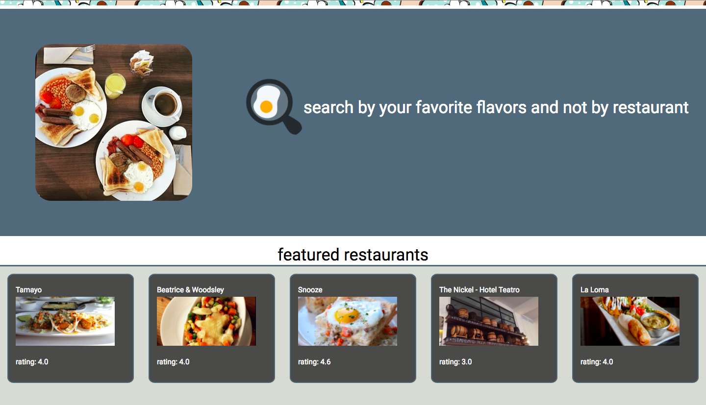
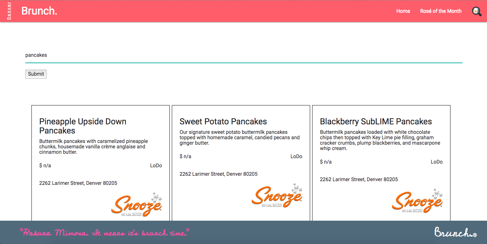
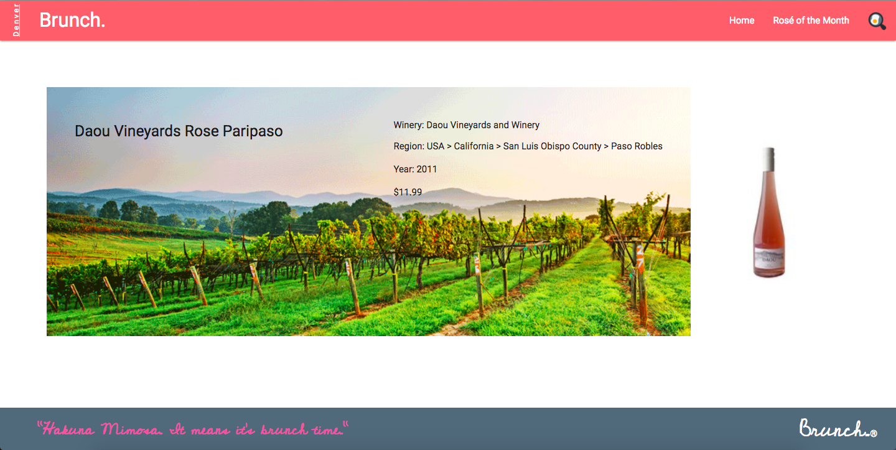

# Brunch. v.1

### Problem Motivation
having to search through multiple restaurant's menus in order to find what you would like to eat

### My Solution
breaking down the search function to what food you are hungry for and giving you those options before getting into the restaurant info.

This is eliminating a step and getting straight to what food you are hungry for.

## Functionality
Brunch. is currently deployed as a fully functional webapp, working on screen sizes 1000px or larger through Firebase.

You can visit **[Brunch.](https://brunch-app-project-1.firebaseapp.com)**

## 

#### Features include
* Rosé of the Month
  * once a month recommendation for rosé wine to go with your brunch selection

* Searching by food items rather than restaurants
  * ex. pancakes, eggs, coffee, etc.

* Currently only limited amount of data and Denver located restaurants

#### Screenshots

### API's used
  * wine selected from the [Snooth Wine API](https://api.snooth.com/)
  * [Giphy API](https://developers.giphy.com/)
  * [Zomato API](https://developers.zomato.com/api)
